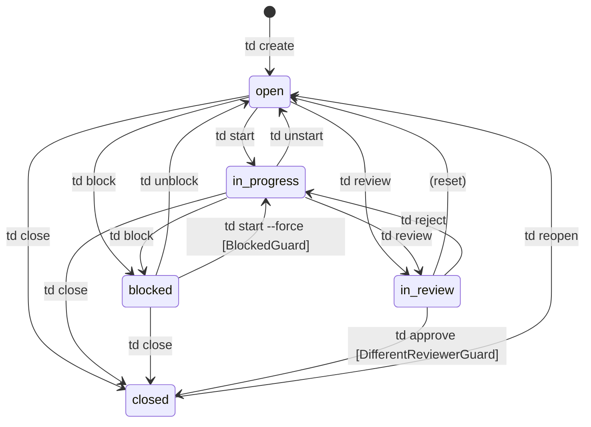

# Section 04: Process Flowcharts

## 1. Issue Lifecycle State Machine

Verified against `internal/workflow/transitions.go:AllTransitions()` which defines exactly 15 transitions across 5 statuses. Guards are verified from `internal/workflow/guards.go`.

### State Diagram (Mermaid)



### ASCII State Diagram

```
                                 td create
                                     |
                                     v
                      +---------- [OPEN] <-----------+
                      |           /  |  \             |
          td start    | td block /   |   \ td review  | td reopen
                      |         /    |    \           |
                      v        v     |     v          |
              [IN_PROGRESS]  [BLOCKED]  [IN_REVIEW]  [CLOSED]
                |    |  \      |  \        |    \      ^  ^
    td unstart  |    |   \     |   \       |     \     |  |
    (to open)   |    |    \    |    \      |      \    |  |
                |    |     |   |     |     |       |   |  |
                |    |  td |   | td  |  td |    td |   |  |
                |    | block  |start | reject  approve |  |
                |    |     |   |(+force)  |       |    |  |
                |    |     v   |     v    v       v    |  |
                |    +-->[BLOCKED]  [OPEN] [IN_PROGRESS]  |
                |                                         |
                +----- td close --------------------------+
                |                                         |
                +----- td review --> [IN_REVIEW] ---------+
```

### Transition Table (Complete)

| From | To | Command | Guard(s) | Notes |
|---|---|---|---|---|
| open | in_progress | `td start` | None | Captures git snapshot, sets focus |
| open | blocked | `td block` | None | |
| open | in_review | `td review` | None | Direct submission allowed |
| open | closed | `td close` | None | Self-close prevention in cmd layer |
| in_progress | open | `td unstart` | None | Reverts to open |
| in_progress | blocked | `td block` | None | |
| in_progress | in_review | `td review` | None | Primary review path; auto-creates handoff if missing |
| in_progress | closed | `td close` | None | Self-close prevention in cmd layer |
| blocked | open | `td unblock` | None | |
| blocked | in_progress | `td start --force` | **BlockedGuard** | Requires `--force` flag in Advisory/Strict modes |
| blocked | closed | `td close` | None | |
| in_review | open | (reset) | None | |
| in_review | in_progress | `td reject` | None | Returns for rework with reason |
| in_review | closed | `td approve` | **DifferentReviewerGuard** | Prevents self-approval; checks WasSessionInvolved, creator/implementer session |
| closed | open | `td reopen` | None | |

### Guard Behavior by Mode

| Mode | Behavior | Source |
|---|---|---|
| **Liberal** (default) | All guard checks skipped | `workflow.go:167-169` |
| **Advisory** | Guards run, results returned as warnings, transition allowed | `workflow.go:190-192` |
| **Strict** | Guards run, transition blocked if any guard fails | `workflow.go:195-198` |

### Self-Review Prevention Flow (cmd layer, outside state machine)

```
td approve <issue-id>
    |
    v
Check: issue.Minor == true?
    |-- YES --> Allow (skip review checks)
    |-- NO  --> Continue
    v
Check: issue.ImplementerSession == currentSession?
    |-- YES --> REJECT: "cannot approve your own implementation"
    |-- NO  --> Continue
    v
Check: issue.CreatorSession == currentSession?
    |-- YES --> REJECT: "cannot approve issue you created"
    |-- NO  --> Continue
    v
Check: db.WasSessionInvolved(issueID, sessionID)?
    |-- YES --> REJECT: "cannot approve issue you were involved with"
    |-- NO  --> ALLOW: Approve proceeds
```

**Source:** `cmd/review.go` -- checks performed before calling the workflow state machine.

---

## 2. Session Management Flow

Verified against `internal/session/session.go:GetOrCreate()` and `internal/session/agent_fingerprint.go:GetAgentFingerprint()`.

### Session Resolution Flow

```
td <any command>
    |
    v
session.GetOrCreate(db)
    |
    +-- Acquire mutex (getOrCreateMu)
    |
    +-- getCurrentBranch()
    |       |
    |       +-- git.GetState()
    |       |       |-- success: return branch name
    |       |       |-- "HEAD" or empty: "detached-<sha[:8]>"
    |       |       |-- error: "default"
    |
    +-- GetAgentFingerprint()
    |       |
    |       +-- Priority 1: TD_SESSION_ID env var?
    |       |       YES --> return explicit fingerprint
    |       |
    |       +-- Priority 2: CURSOR_AGENT env var?
    |       |       YES --> return cursor + ppid
    |       |
    |       +-- Priority 3: Walk process ancestry (cached)
    |       |       |
    |       |       +-- detectAgentAncestor()
    |       |       |       |
    |       |       |       +-- Walk up to 15 levels via ps -o ppid=,comm=
    |       |       |       |
    |       |       |       +-- Match against patterns:
    |       |       |       |   claude -> claude-code
    |       |       |       |   cursor -> cursor
    |       |       |       |   codex  -> codex
    |       |       |       |   windsurf -> windsurf
    |       |       |       |   zed    -> zed
    |       |       |       |   aider  -> aider
    |       |       |       |   copilot -> copilot
    |       |       |       |   gemini -> gemini
    |       |       |       |
    |       |       |       +-- Found? return AgentFingerprint{Type, PID}
    |       |       |       +-- Not found? return unknown
    |       |
    |       +-- Priority 4: Terminal session env vars?
    |       |       TERM_SESSION_ID, TMUX_PANE, STY,
    |       |       WINDOWID, KONSOLE_DBUS_SESSION,
    |       |       GNOME_TERMINAL_SCREEN
    |       |       YES --> return terminal fingerprint
    |       |
    |       +-- Fallback: return unknown
    |
    +-- MigrateFileSystemSessions() -- one-time legacy migration
    |
    +-- db.GetSessionByBranchAgent(branch, fp.String(), fp.PID)
    |       |
    |       +-- Found existing session?
    |       |       YES --> Update heartbeat, return session (IsNew=false)
    |       |       NO  --> Create new session
    |       |                   |
    |       |                   +-- generateID() --> "ses_<6hex>"
    |       |                   +-- db.UpsertSession()
    |       |                   +-- return session (IsNew=true)
    |
    +-- Release mutex
```

### Session Identity Scoping

```
Session ID = unique per (branch, agent_fingerprint)

agent_fingerprint = agent_type + "_" + pid
                    e.g., "claude-code_12345"

Session scope ensures:
  - Same agent on same branch = SAME session (continuity)
  - Same agent on different branch = DIFFERENT session (isolation)
  - Different agent on same branch = DIFFERENT session (review separation)
  - New context window of same agent = SAME session (if PID matches ancestor)
```

### Force New Session Flow (`td usage --new-session`)

```
ForceNewSession(db)
    |
    +-- getCurrentBranch()
    +-- GetAgentFingerprint()
    |
    +-- Look up existing session by branch+agent
    |       Found? --> Record its ID as previousSessionID
    |
    +-- Create new session with:
    |       - New random ID (ses_<6hex>)
    |       - PreviousSessionID = old session ID
    |       - IsNew = true
    |
    +-- Upsert into DB (replaces old session for this branch+agent)
```

---

## 3. Sync Protocol Flow

Verified against `internal/sync/client.go`, `internal/syncclient/client.go`, and `internal/sync/engine.go`.

### Push Flow

```
Local mutation (e.g., td create)
    |
    v
db.CreateIssueLogged()
    |
    +-- withWriteLock() acquires file lock
    |
    +-- BEGIN TRANSACTION
    |       |
    |       +-- INSERT INTO issues (...)
    |       +-- INSERT INTO action_log (
    |       |       action_type, entity_type, entity_id,
    |       |       previous_data, new_data, timestamp,
    |       |       synced_at=NULL, undone=0
    |       |   )
    |       |
    |       +-- COMMIT
    |
    +-- Release file lock
    |
    v
PersistentPostRun (auto-sync hook)
    |
    +-- sync enabled? Feature flag sync_autosync?
    |       NO --> return
    |
    v
sync.GetPendingEvents(tx, deviceID, sessionID)
    |
    +-- BackfillOrphanEntities() -- create synthetic events for pre-existing data
    +-- BackfillStaleIssues() -- create events for issues modified but not in action_log
    |
    +-- SELECT FROM action_log WHERE synced_at IS NULL AND undone = 0
    |
    +-- For each row:
    |       |
    |       +-- normalizeEntityType() (issues, handoffs, boards, logs, ...)
    |       +-- mapActionType() (create, update, delete, soft_delete, restore)
    |       +-- Build Event with payload: {schema_version, new_data, previous_data}
    |
    v
syncclient.Client.Push(projectID, PushRequest{events})
    |
    +-- POST /v1/projects/{id}/sync/push
    |       Authorization: Bearer <api_key>
    |       Body: {device_id, session_id, events[]}
    |
    v
Server: sync.InsertServerEvents()
    |
    +-- Deduplication by (device_id, session_id, client_action_id)
    +-- Assign monotonic server_seq to each event
    +-- Return PushResult{Accepted, Acks[], Rejected[]}
    |
    v
Client: sync.MarkEventsSynced(tx, acks)
    |
    +-- UPDATE action_log SET synced_at=NOW, server_seq=?
    |   WHERE rowid = ?
```

### Pull Flow

```
td sync pull (or auto-sync on startup)
    |
    v
syncclient.Client.Pull(projectID, afterSeq, limit=500, excludeDeviceID)
    |
    +-- GET /v1/projects/{id}/sync/pull?after_server_seq=N&limit=500
    |       &exclude_client=<my_device_id>
    |
    v
Server returns PullResponse{Events[], LastServerSeq, HasMore}
    |
    v
sync.ApplyRemoteEvents(tx, events, myDeviceID, validator, lastSyncAt)
    |
    +-- For each event:
    |       |
    |       +-- Unmarshal payload wrapper: {new_data, previous_data}
    |       |
    |       +-- applyEventWithPrevious(tx, event, validator, previousData)
    |       |       |
    |       |       +-- Validate entity type (validator function)
    |       |       +-- Apply: INSERT/UPDATE/DELETE based on action_type
    |       |       +-- Uses UNLOGGED DB operations (no action_log entry)
    |       |       +-- Returns: {Overwritten bool, OldData json.RawMessage}
    |       |
    |       +-- Conflict detection:
    |       |       Was local row modified AFTER lastSyncAt?
    |       |       YES --> Record ConflictRecord{entity, local_data, remote_data}
    |       |       NO  --> Clean overwrite
    |       |
    |       +-- Increment Applied count, update LastAppliedSeq
    |
    v
Update local sync_state with new cursor (last_server_seq)
    |
    +-- If HasMore == true: Pull again (pagination loop)
```

### Snapshot Bootstrap Flow (First Sync)

```
td sync init (first time setup)
    |
    v
syncclient.Client.GetSnapshot(projectID)
    |
    +-- GET /v1/projects/{id}/sync/snapshot
    |       Returns: SQLite database file + X-Snapshot-Seq header
    |
    v
Replace local .todos/issues.db with snapshot
    |
    +-- Set sync cursor to snapshot_seq
    +-- Pull remaining events after snapshot_seq
```

### Event Deduplication

```
Server receives push:
    |
    +-- For each event:
    |       |
    |       +-- Check: EXISTS in events WHERE
    |       |       device_id = ? AND
    |       |       session_id = ? AND
    |       |       client_action_id = ?
    |       |
    |       +-- Duplicate? --> Reject with reason="duplicate", return existing server_seq
    |       +-- New?       --> Assign next server_seq, INSERT, return Ack
```

---

## 4. TUI Monitor Navigation Flow

Verified against `pkg/monitor/commands.go`, `pkg/monitor/model.go`, and `pkg/monitor/keymap/`.

### Main TUI Layout

```
+------------------------------------------------------------------+
|                        td monitor                                 |
+------------------------------------------------------------------+
|  [Current Work] Panel (top)                                       |
|    Focused issue details, in-progress issues                      |
|                                                                   |
+--  Draggable divider  ------------------------------------------+
|                                                                   |
|  [Task List] Panel (middle)                                       |
|    Categorized view OR Board view (swimlanes/backlog/kanban)      |
|                                                                   |
+--  Draggable divider  ------------------------------------------+
|                                                                   |
|  [Activity] Panel (bottom)                                        |
|    Unified activity feed (logs, actions, comments)                |
|                                                                   |
+------------------------------------------------------------------+
|  Footer: keybindings hint | view mode | filter status             |
+------------------------------------------------------------------+
```

### Input Handling Flow

```
User presses key
    |
    v
model.Update(tea.KeyMsg)
    |
    +-- Is FormOpen? --> Delegate to huh form handler
    |       (Ctrl+C exits form, form submit triggers create/edit)
    |
    +-- Is SyncPromptOpen? --> Handle Y/N/Esc for sync prompt
    |
    +-- Is GettingStartedOpen? --> Handle Esc/Enter to dismiss
    |
    +-- Is ShowTDQHelp? --> Handle Esc to dismiss
    |
    +-- Is StatsOpen? --> Delegate to stats modal (Esc closes)
    |
    +-- Is HandoffsOpen? --> Delegate to handoffs modal (Esc closes)
    |
    +-- Is BoardEditorOpen? --> Delegate to board editor
    |       (Tab between fields, Enter save, Esc cancel)
    |
    +-- Is BoardPickerOpen? --> Delegate to board picker
    |       (j/k select, Enter choose, Esc cancel)
    |
    +-- Is ConfirmOpen (delete)? --> Handle Y/N/Tab/Enter
    |
    +-- Is CloseConfirmOpen? --> Handle Y/N/Tab/Enter with reason input
    |
    +-- keymap.Registry.Resolve(key, currentContext())
    |       |
    |       +-- Returns Command constant (e.g., CmdOpenDetails)
    |       +-- No match? --> return (key not bound in this context)
    |
    +-- executeCommand(command)
            |
            +-- ~60 command cases in switch statement
            |
            +-- Navigation: CmdUp, CmdDown, CmdTop, CmdBottom,
            |               CmdHalfPageUp, CmdHalfPageDown,
            |               CmdNextPanel, CmdPrevPanel,
            |               CmdFocusPanel1/2/3
            |
            +-- Actions:    CmdOpenDetails, CmdCloseModal,
            |               CmdStartIssue, CmdSubmitReview,
            |               CmdApproveIssue, CmdRejectIssue,
            |               CmdDeleteIssue, CmdCloseIssue,
            |               CmdToggleClosed, CmdNewIssue, CmdEditIssue
            |
            +-- Views:      CmdCycleViewMode, CmdBoardPicker,
            |               CmdToggleSearch, CmdShowHelp,
            |               CmdShowStats, CmdShowHandoffs,
            |               CmdShowTDQHelp
            |
            +-- Board:      CmdKanbanLeft, CmdKanbanRight,
            |               CmdKanbanMoveUp, CmdKanbanMoveDown,
            |               CmdKanbanMoveTop, CmdKanbanMoveBottom
            |
            +-- Sort/Filter: CmdCycleSortMode, CmdCycleTypeFilter
            |
            +-- Quit:       CmdQuit
```

### Context Hierarchy (Precedence Order)

The keymap context determines which keybindings are active. Contexts are checked in this order (first match wins):

```
1. SyncPromptOpen      --> ContextSyncPrompt
2. GettingStartedOpen  --> ContextGettingStarted
3. HelpOpen            --> ContextHelp
4. CloseConfirmOpen    --> ContextCloseConfirm
5. ConfirmOpen         --> ContextConfirm
6. BoardEditorOpen     --> ContextBoardEditor
7. BoardPickerOpen     --> ContextBoardPicker
8. FormOpen            --> ContextForm
9. HandoffsOpen        --> ContextHandoffs
10. StatsOpen          --> ContextStats
11. ShowTDQHelp        --> ContextTDQHelp
12. SearchMode         --> ContextSearch
13. ModalOpen          --> ContextModal (with sub-contexts:
                              ParentEpicFocused, EpicTasks,
                              BlockedByFocused, BlocksFocused)
14. BoardMode          --> ContextBoard
     |-- KanbanView    --> ContextKanban
15. (default)          --> ContextMain
```

**Source:** `pkg/monitor/commands.go:24-108` (`currentContext()` method)

### Modal Stack Navigation

```
User presses Enter on issue
    |
    v
pushModal(issueID)
    |
    +-- Append ModalEntry to ModalStack[]
    +-- Fire fetchIssueDetails(issueID) as tea.Cmd
    |
    v
IssueDetailsMsg received
    |
    +-- Populate ModalEntry with issue, handoff, logs, comments,
    |   dependencies, children, git snapshots
    +-- Fire renderMarkdownAsync() for description
    |
    v
Modal displayed with scrollable detail view
    |
    +-- User presses Enter on child/dependency issue
    |       |
    |       +-- pushModal(childIssueID)  <-- stacks on top
    |       +-- Previous modal preserved in ModalStack
    |
    +-- User presses Esc
    |       |
    |       +-- popModal()
    |       +-- If ModalStack not empty: show previous modal
    |       +-- If ModalStack empty: return to main view
```

### View Mode Cycling

```
User presses 'v' (CmdCycleViewMode)
    |
    v
BoardMode active?
    |-- NO (categorized view) --> No cycling in categorized mode
    |-- YES --> Cycle:
            |
            +-- Swimlanes --> Backlog --> Kanban --> Swimlanes
            |
            +-- Each mode renders Task List panel differently:
                    |
                    +-- Swimlanes: Issues grouped by status category
                    |   (Review, Ready, Blocked, Closed)
                    |   with cursor navigation
                    |
                    +-- Backlog: Flat ordered list with
                    |   position-based sorting
                    |
                    +-- Kanban: Side-by-side status columns
                        (Open, In Progress, In Review, Closed)
                        h/l for column navigation
                        j/k for within-column navigation
```

### Data Refresh Cycle

```
model.Init()
    |
    +-- scheduleTick(tickInterval)  -- periodic timer
    |
    v
TickMsg received (every N seconds)
    |
    v
fetchData() --> tea.Cmd
    |
    +-- FetchData(db, sessionID, config)
    |       |
    |       +-- Get focused issue
    |       +-- Get in-progress issues
    |       +-- Get activity feed (logs + actions)
    |       +-- Get task list (categorized or board-filtered)
    |       +-- Get handoffs
    |       +-- Get work session info
    |
    v
RefreshDataMsg received
    |
    +-- Update Model fields:
    |       FocusedIssue, InProgressIssues, ActivityItems,
    |       TaskListData, Handoffs, WorkSession
    |
    +-- Trigger View() re-render
    |
    +-- scheduleTick() again for next cycle
```

---

## 5. TDQ Query Execution Flow

Verified against `internal/query/parser.go`, `internal/query/evaluator.go`, and `internal/query/execute.go`.

```
User runs: td query "status=open AND priority<=P1 sort:-updated"
    |
    v
query.Parse(input)
    |
    +-- Lexer.Tokenize(input)
    |       |
    |       +-- Produce tokens: [IDENT:status, EQ, IDENT:open,
    |       |   AND, IDENT:priority, LTE, IDENT:P1,
    |       |   SORT, COLON, MINUS, IDENT:updated]
    |
    +-- Parser.parseQuery(tokens)
    |       |
    |       +-- Recursive descent with precedence:
    |       |       OR < AND < NOT < comparison
    |       |
    |       +-- Produce AST:
    |       |   BinaryExpr{
    |       |     Op: AND,
    |       |     Left: FieldExpr{Field:"status", Op:"=", Value:"open"},
    |       |     Right: FieldExpr{Field:"priority", Op:"<=", Value:"P1"}
    |       |   }
    |       |   SortClause{Field:"updated", Descending:true}
    |       |
    |       +-- Depth limit: 50 nested expressions
    |
    v
query.Validate(ast)
    |
    +-- Check field names are valid (status, priority, etc.)
    +-- Check operator compatibility (= for enums, ~ for text)
    +-- Normalize enum values (p1 -> P1, review -> in_review)
    |
    v
query.Execute(db, queryStr, sessionID, opts)
    |
    +-- Fetch candidate issues from DB
    |       |
    |       +-- db.ListIssues(ListIssuesOptions{...})
    |       |       Cap: 10,000 issues maximum
    |       |
    |       +-- If cross-entity queries (log.*, handoff.*, etc.):
    |               Fetch related entities for each candidate
    |
    +-- Evaluator.Evaluate(issue, ast) for each candidate
    |       |
    |       +-- Walk AST tree:
    |       |       BinaryExpr AND: evaluate left AND right
    |       |       FieldExpr "status=open": issue.Status == "open"
    |       |       FieldExpr "priority<=P1": comparePriority(issue.Priority, "P1")
    |       |
    |       +-- Function evaluation:
    |       |       has(field): field is non-empty
    |       |       is(status): status matches
    |       |       any(field, v1, v2): field matches any value
    |       |       blocks(id): issue is blocked by id
    |       |       blocked_by(id): issue blocks id
    |       |       descendant_of(id): issue is descendant of parent/epic
    |       |       rework(): issue was rejected (back from review)
    |       |       stale(N): not updated in N days
    |       |
    |       +-- @me resolution: replace with current sessionID
    |       +-- Relative dates: -7d = 7 days ago, -24h = 24 hours ago
    |
    +-- Sort results by SortClause
    |       Sort field: priority, created, updated, closed, points, title
    |       Direction: ascending (default) or descending (-)
    |
    +-- Apply limit if specified
    |
    v
Return filtered, sorted issue list
```

---

## 6. CLI Command Execution Flow

Verified against `cmd/root.go` and `cmd/create.go` as representative example.

```
User runs: td create "Implement OAuth2 flow" --type feature --priority P1
    |
    v
main.main()
    |
    +-- effectiveVersion() resolves version
    +-- cmd.Execute() runs Cobra
    |
    v
rootCmd.PersistentPreRun
    |
    +-- Resolve working directory (workdir.ResolveBaseDir)
    +-- Open database (db.Open)
    +-- Run auto-sync pull (if enabled)
    +-- Initialize session (session.GetOrCreate)
    +-- Track analytics (if enabled)
    |
    v
createCmd.RunE
    |
    +-- Parse type from title prefix ("feature: ..." -> type=feature)
    +-- Validate title (min/max length, reject generic titles)
    +-- Parse priority ("P1" -> models.PriorityP1)
    +-- Parse labels, points, dependencies
    +-- Capture git snapshot (branch, commit SHA, dirty files)
    +-- db.CreateIssueLogged() -- atomic write + action_log entry
    +-- Set creator session on issue
    +-- output.Success("Created issue td-xxxxx")
    |
    v
rootCmd.PersistentPostRun
    |
    +-- Run auto-sync push (if enabled, debounced)
    +-- Record analytics
    +-- Close database
```

---

## 7. File Locking Protocol

Verified against `internal/db/lock.go`.

```
db.withWriteLock(fn)
    |
    v
acquire file lock: <project>/.todos/issues.lock
    |
    +-- Try flock(LOCK_EX | LOCK_NB)
    |       |
    |       +-- Success? --> Got lock, proceed
    |       +-- EWOULDBLOCK? -->
    |               |
    |               +-- Read lock file for PID + timestamp
    |               +-- Lock older than stale threshold?
    |               |       YES --> Force acquire (stale lock)
    |               |       NO  --> Exponential backoff retry
    |               |
    |               +-- Max retries exceeded?
    |                       YES --> return error "lock acquisition timeout"
    |
    +-- Write PID + timestamp to lock file
    |
    +-- Execute fn() (the write operation)
    |
    +-- Release lock: flock(LOCK_UN)
    +-- Remove lock file
```

Platform-specific implementations:
- Unix: `flock()` syscall via `lock_unix.go`
- Windows: `LockFileEx()` via `lock_windows.go`
